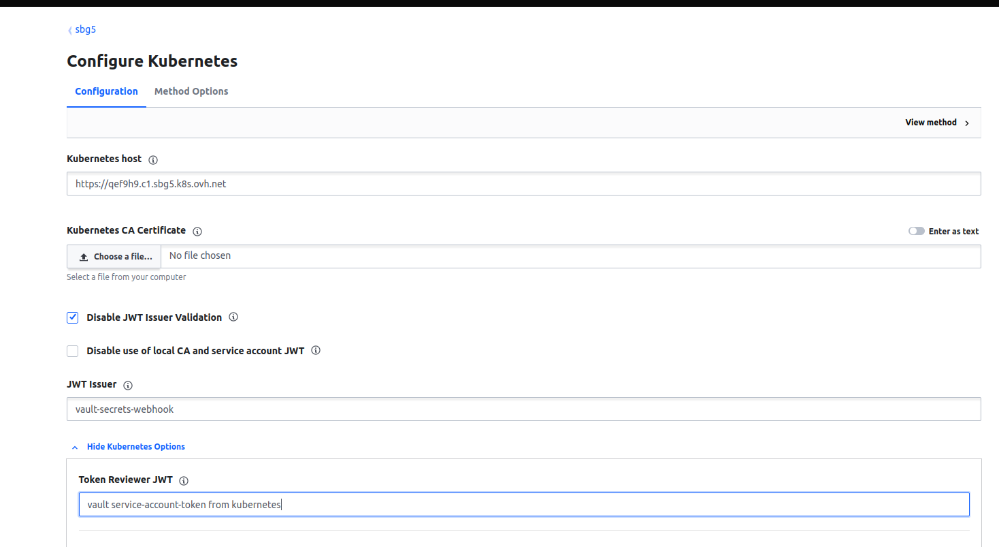
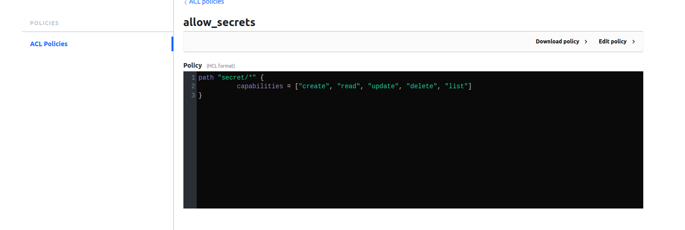
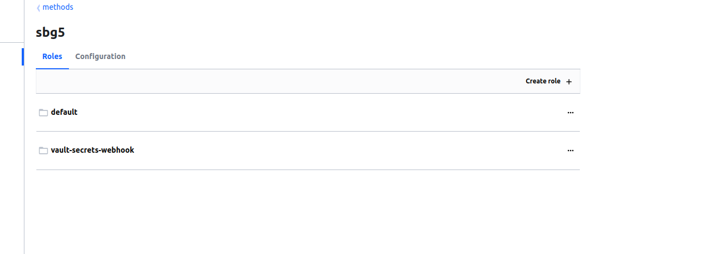
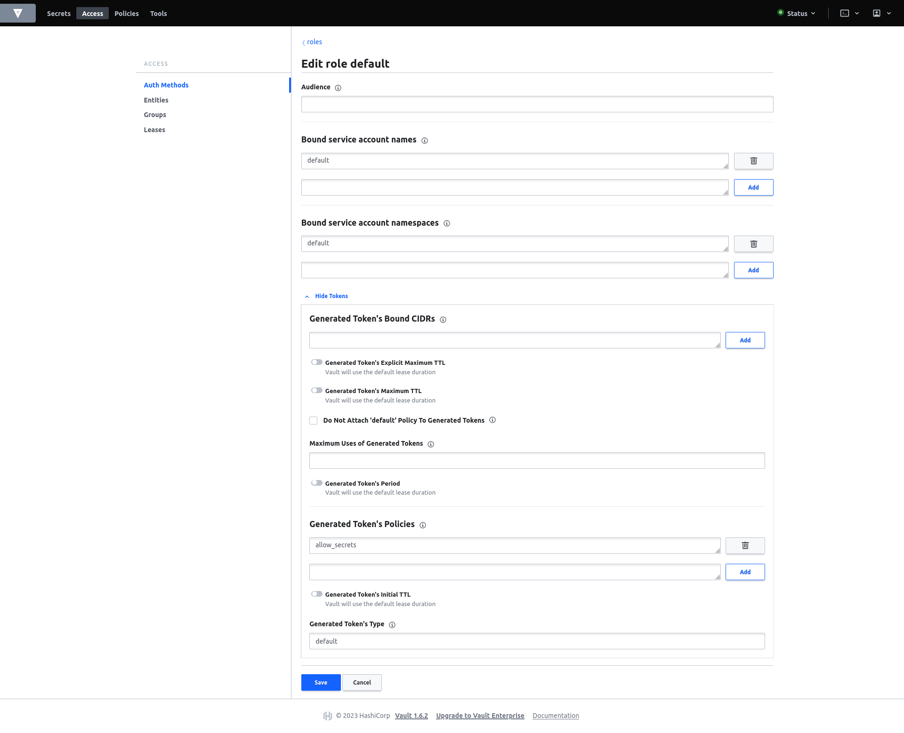

# VAULT

1. for each cluster, create a service account token
```
kubectl -n jx-vault apply -f - <<EOF
apiVersion: v1
kind: Secret
metadata:
  name: vault-k8s-auth-secret
  annotations:
    kubernetes.io/service-account.name: vault-secrets-webhook
type: kubernetes.io/service-account-token

---
apiVersion: rbac.authorization.k8s.io/v1
kind: ClusterRoleBinding
metadata:
  name: vault-auth-delegator
subjects:
  - kind: ServiceAccount
    name: vault-secrets-webhook
    namespace: jx-vault
roleRef:
  apiGroup: rbac.authorization.k8s.io
  kind: ClusterRole
  name: system:auth-delegator
EOF
```

## Vault authentification methods

1. each cluster must have a kubernetes auth method eg: (sgb5, sgp1)


2. Configure each authentification like this:



__kubernetes_host:__ `get the host from your ~/.kube/config`

__kubernetes_ca:__ `get the host from your ~/.kube/config`

__disable_jwt_issuer_validation:__ `true`

__jwt_issuer:__ `vault-secrets-webhook`

__token_reviewer_jwt :__ `kubectl -n jx-vault get secret vault-k8s-auth-secret -o json | jq -r '.data.token' | base64 -d`


## Create the vault policy


## Create roles __for each__ vault authentification method



# Troubleshooting
